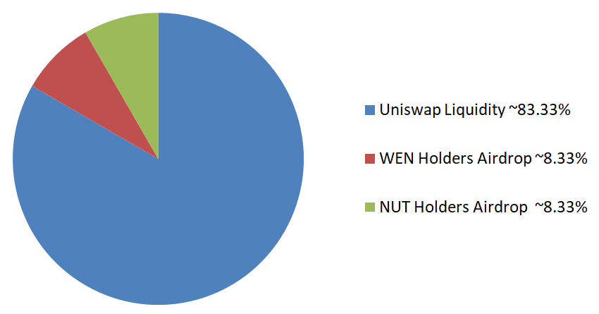

# About Wencash

**Wencash (WEN) ERC-20 token contract: [0xEBA6145367b33e9FB683358E0421E8b7337D435f](https://etherscan.io/token/0xEBA6145367b33e9FB683358E0421E8b7337D435f)**

**/!\ Wencash L1 chain is still not released. As long as the Wencash L1 chain and its bridge from/to Ethereum are not released, WEN ERC-20 token may be seen as a memecoin, relying on "WEN" memes.** 

*Below is the future draft description that will be on [CoinMarketCap](https://coinmarketcap.com/). The launch is divided into several phases:*

- ✅ *WEN ERC-20 token and locked liquidity pools deployments.*
- ❌ *Wencash v1 standalone chain launch.*
- ❌ *Set up of both ways trustless and permissionless bridge between Ethereum and Wencash.*

*/!\ Everything will be on Open Source Licenses. But even once released, the software has to be seen as an experimental technology and not as production ready. A bug, a hack or human errors can cause a loss up to 100% of assets. We will not be responsible, or liable to you or any third party, for any loss or damage of property or injuries related to your use of Wencash chain.*

## What Is Wencash (WEN)? 

Wencash is a [Layer-1 blockchain](https://coinmarketcap.com/alexandria/glossary/layer-1-blockchain) based on the open source code of [Ethereum](https://coinmarketcap.com/currencies/ethereum/) (Execution and Consensus Layers). Therefore, Wencash is a decentralized, secure, and scalable application platform, enabling the writing of smart contracts and the building of a wide range of applications with global accessibility. Almost all existing Ethereum tool stack are compatible with Wencash.

WEN is the native token of Wencash chain and it is also available on Ethereum blockchain as an [ERC-20 token](https://coinmarketcap.com/academy/glossary/erc-20). Tokens exchange (including WEN) between these two blockchains will be enabled through a trustless and permissionless bridge deployed on both chains.
    
## Who Are the Founders of Wencash?

For now, the founders of Wencash remain anonymous, which is pretty usual in the cryptocurrency world. Although information about the team behind the project is scarce, they can be easily reached through their social media platforms, such as X.

## What Makes Wencash Unique?

The main element that differentiates Wencash from Ethereum is the teams behind the projects and so the different visions. The goal remains the same: solving the [blockchain scalability trilemma](https://vitalik.ca/general/2021/04/07/sharding.html), but the methods will be different. 

Here are the Wencash ways:

- Priority on social/community consensus for recurrent forks keeping only the blockchain state without the historical data which will be saved in p2p networks like BitTorrent or in other solutions stated in [EIP-4844 FAQ](https://notes.ethereum.org/@vbuterin/proto_danksharding_faq#If-data-is-deleted-after-30-days-how-would-users-access-older-blobs). Wencash has to be light as long as possible in order to run full nodes on smartphones to enhance decentralization.
- Since the [Rollup-centric Ethereum roadmap](https://ethereum-magicians.org/t/a-rollup-centric-ethereum-roadmap/4698), the current Ethereum updates related to scalability are mainly intended for Layers-2. But today, in November 2023, almost all the Layers-2 are still not fully decentralized (upgradable smart contracts, centralized sequencers & proposers, etc. Cf. [l2beat risks](https://l2beat.com/scaling/risk)). On Wencash side, the focus will be on setting up its own fully decentralized Layer-2 and if necessary, fork the Ethereum base code to prioritize Consensus blob space to its native Layer-2 and so avoid a potential block space war between L2s.
- Reintroduction of miners related to [Zero Knowledge Proofs Hardware Acceleration](https://www.paradigm.xyz/2022/04/zk-hardware) for the Wencash native Layer-2. 
- Our Web3 vision is also different. While some teams increase DEX fees in order to pay the rising costs of their web GUI maintenance, we will focus on delevering standalone tools locally executable and providing educational materials in order to remove another big layer of third parties. Running decentralized apps on smartphones or on computers and not relying on web app based on giant data centers will be more censorship resistant, will save a huge amount of infrastructure cost and will also reduce the environmental impact.

All of this will take years and will not be available on the first release of Wencash which will be a mere Ethereum code source fork, without any modifications except the minimum number of Genesis validators, set to 2048.

## How Many Wencash (WEN) Coins Are There in Circulation?

The initial supply for the ERC-20 WEN on Ethereum is set to 100 million (100,000,000) token supply in circulation. 

Of this initial supply, 100% were sent to two liquidity pools on [Uniswap](https://coinmarketcap.com/academy/article/how-to-use-uniswap). The Liquidity Provider (LP) tokens were burnt (sent to the WEN contract token through these two transactions [here](https://etherscan.io/tx/0x06e59fce1a4d9a56077e3e17744296407b2884b43ea1df335309f36e83816630) and [there](https://etherscan.io/tx/0xfc970d8a8897985e944b8a17a6c166c884b4a75be1848eb9e4dfe68f17a8cf9e)) to ensure that the initial liquidity can never be removed. Users can track the two pools on CMC DexScan: 
- [NUT/WEN](https://coinmarketcap.com/dexscan/ethereum/0xd813e7ac5bb5067ca548e4d9ba441d95003d074f/)
- [WEN/ETH](https://coinmarketcap.com/dexscan/ethereum/0xcf4d1c0470c8e2ae8bf8160dc1c0ac25f00bb702/)

Besides, 20 million (20,000,000) tokens will be airdropped on Wencash chain Genesis file to: 

- 100,000 first WEN holders with at least 500 WEN: 100 WEN airdrop each.
- 100,000 first [NUT](https://coinmarketcap.com/currencies/nutcoin-org/)  holders with at least 100,000,000 NUT: 100 WEN airdrop each.

These two airdrops are cumulative if one address meets both criteria. The snapshot will be done at the Ethereum block #18909332 (Monday Jan 01 2024). If there are less holders than expected after this date, the remaining WEN from the 20 million will be burnt and set to the null address.

As Ethereum's economics, Wencash is not deflationary, i.e. its total supply is not limited, in order not to justify a "fixed security budget" for the network (according to Ethereum developers). Through the Proof-of-Stake (PoS) consensus mechanism, rewards are distributed to validators. The validators APY (Annual Percentage Yield) can be modelized via some tools such as this [Gnosis dev tool](https://www.desmos.com/calculator/7pzueggivw?lang=fr): change the preset gnosis values with the Ethereum parameters: F=64, T=12, S=32 and with the only changed Wencash variable N=2048 (minimum genesis validators number). Note that the APY decreases according to the total current validators number (1 unit on the x Axis is 100 validators = 3200 WEN).

With the introduction of EIP-1559, the transactions base fees are burned, removing the native WEN from circulation on its chain. This means higher activity on the network would lead to more WEN burned, and potentially make Wencash deflationary. 

## How Is Wencash Secured?

WEN as an [ERC-20](https://coinmarketcap.com/academy/glossary/erc-20) token on the [Ethereum](https://coinmarketcap.com/currencies/ethereum/) blockchain is secured by the Proof-of-Stake (PoS) consensus mechanism, like other ERC-20. Besides, the smart contract has been generated using the open sources contract libraries of OpenZeppelin with no additional features and no access control preselected, increasing its safety.

WEN as a native token of Wencash standalone chain is secured by its code source 100% based on Ethereum, at the beginning.

In order to participate in the protocol security, a Wencash stake is required and you need to deposit exactly 32 WEN to activate 1 validator on Wencash deposit contract. Validators help to secure the network by storing data, processing transactions and adding new blocks to the blockchain. 

## Where Can You Buy WEN?

WEN can be traded on [Uniswap (V2)](https://coinmarketcap.com/exchanges/uniswap-v2/) and more exchanges are to come.

## Related Pages:

Check out [Bitcoin](https://coinmarketcap.com/currencies/bitcoin/) — the layer one blockchain reference.

Find out more about [Ethereum](https://coinmarketcap.com/currencies/ethereum/) — the number one smart contracts platform.

Learn more about [Gnosis Chain](https://coinmarketcap.com/currencies/gnosis-gno/) — another application platform reference forked from Ethereum (Execution & Consensus layers)

Go deeper about what really means decentralization with [Trail of Bits report](https://assets-global.website-files.com/5fd11235b3950c2c1a3b6df4/62af6c641a672b3329b9a480_Unintended_Centralities_in_Distributed_Ledgers.pdf)

Learn and get the latest crypto news on [CoinMarketCap Academy](https://coinmarketcap.com/academy)

## Allocation

### Initial Token distribution

